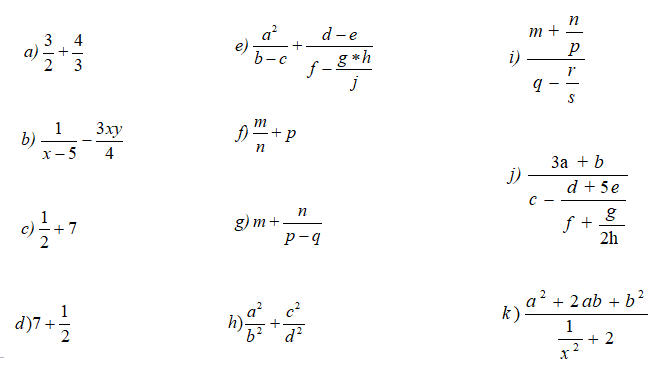
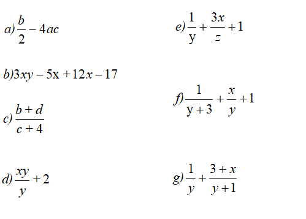

# Conversiones

- Ejercicio: Convierte en expresiones algorítmicas las siguientes expresiones algebráicas. Coloca paréntesis solamente donde sean necesarios.

- 1



- 2




- Ejercicio: Escribe un programa java que declare una variable A de tipo entero y asígnale un valor. A continuación muestra un mensaje indicando si A es par o impar. Utiliza el operador condicional ( ? : ) dentro del println para resolverlo.
 ``` 
    Si por ejemplo A = 14 la salida será

    14 es par

    Si fuese por ejemplo A = 15 la salida será:

    15 es impar
  ```
- Ejercicio:  Escribe un programa java que declare una variable B de tipo entero y asígnale un valor. A continuación muestra un mensaje indicando si el valor de B es positivo o negativo. Consideraremos el 0 como positivo. Utiliza el operador condicional ( ? : ) dentro del println para resolverlo.
```  
Si por ejemplo B = 1 la salida será

1 es positivo

Si fuese por ejemplo B = -1 la salida será:

-1 es negativo
```
- Ejercicio: Escribe un programa java que declare una variable C de tipo entero y asígnale un valor. A continuación muestra un mensaje indicando si el valor de C es positivo o negativo, si es par o impar, si es múltiplo de 5, si es múltiplo de 10 y si es mayor o menor que 100. Consideraremos el 0 como positivo. Utiliza el operador condicional ( ? : ) dentro del println para resolverlo.
```  
Si por ejemplo C = 55 la salida será
    55 es positivo
    55 es impar
    55 es múltiplo de 5                                                                                               
    55 no es múltiplo de 10                                                                                           
    55 es menor que 100
```

# Estructura Condicional

- Ejercicio: 
1. Programa Java que calcule si un numero es par o impar.
Podemos saber si un número es par si el resto de dividir el número entre 2 es igual a cero. En caso contrario el número es impar
El operador Java que calcula el resto de la división entre dos números enteros o no es el operador %
2. Programa que muestre si un número es múltiplo de 10.

# Estructuras Repetitivas
#### Se trata de mostrar los números desde el 1 hasta el 100 utilizando las instrucciones repetitivas while, do while y for.
1. Programa Java que muestre los números del 1 al 100 utilizando la instrucción while.
2. Programa Java que muestre los números del 1 al 100 utilizando la instrucción do..while.
3. Programa Java que muestre los números del 1 al 100 utilizando la instrucción for.
4.  1. Programa que lea números enteros por teclado y para cada número introducido indique si es positivo o negativo y si es par o impar. Se deben realizar tres versiones del programa:
    2. En la primera versión se utilizará un bucle while. La lectura de números finalizará cuando se introduzca un cero.
    3. En la segunda versión se utilizará un bucle do .. while. La lectura de números en esta versión también finaliza cuando se introduzca un cero.
    4. En la tercera versión también se utilizará un bucle do .. while pero en este caso la lectura de números finaliza cuando se responda ‘N’ ó ‘n’ a la pregunta “Desea introducir más números? (S/N):”

